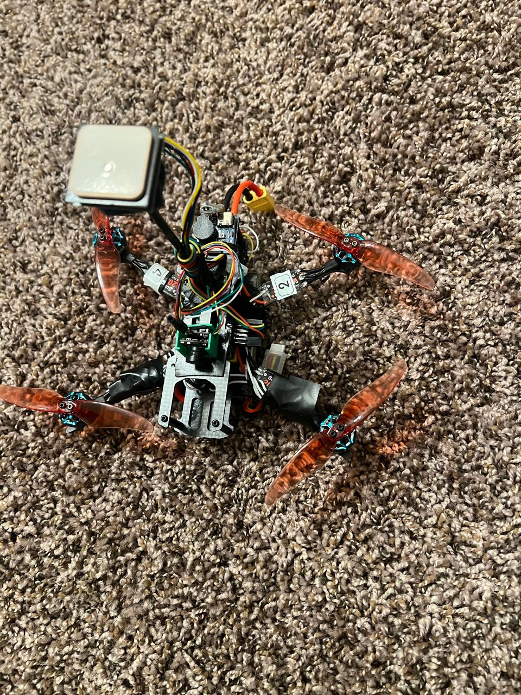
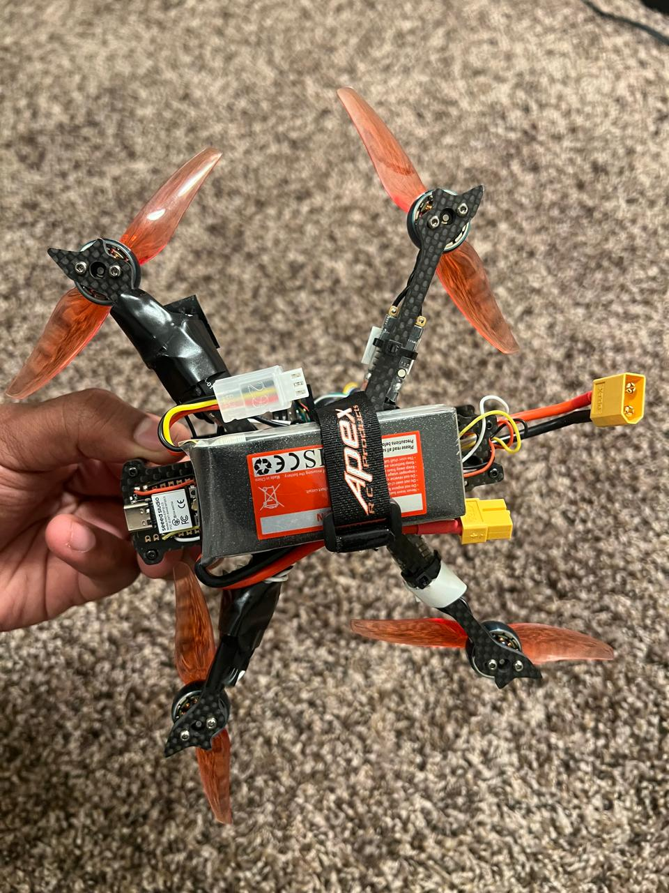
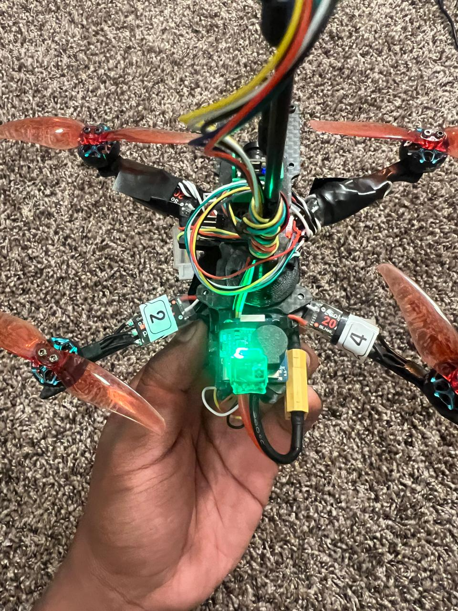
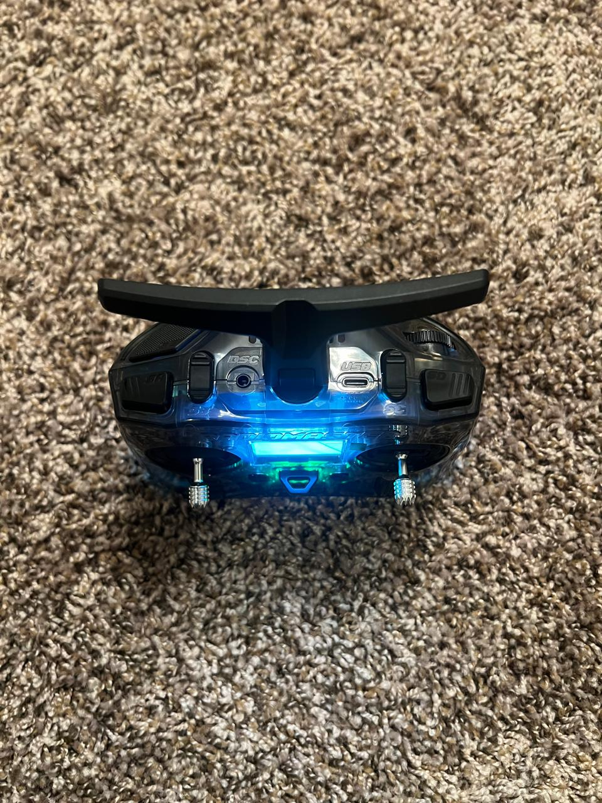
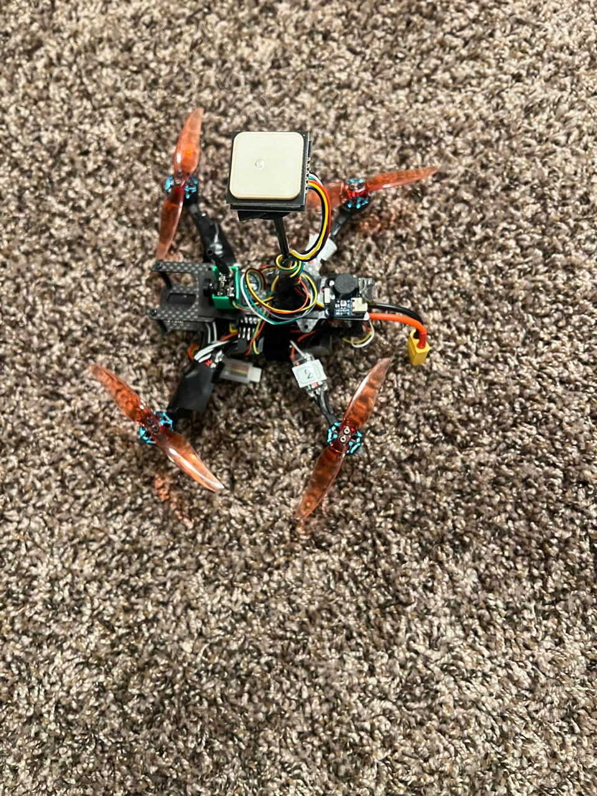
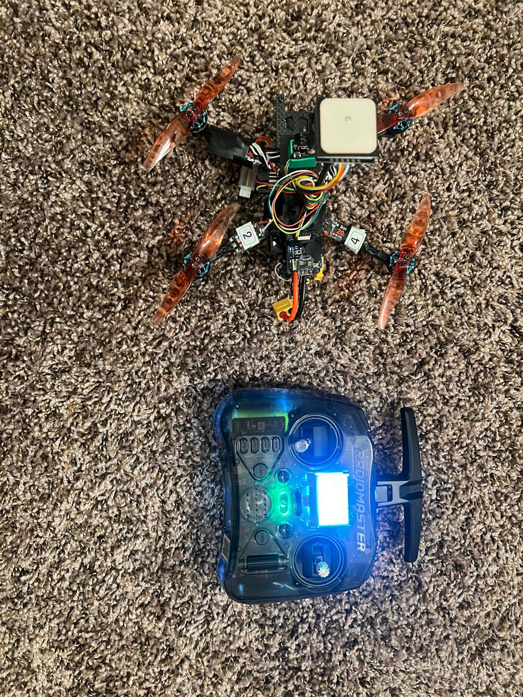
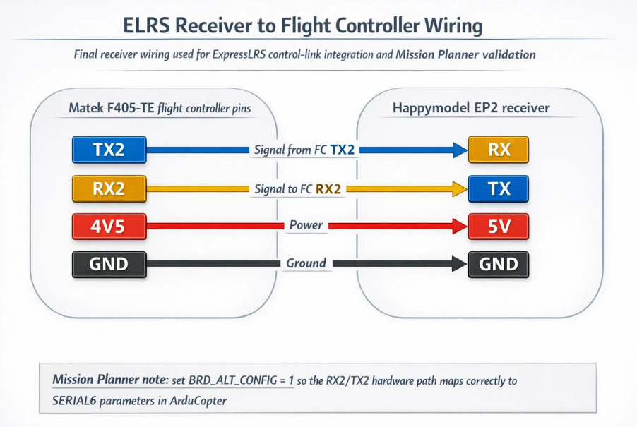
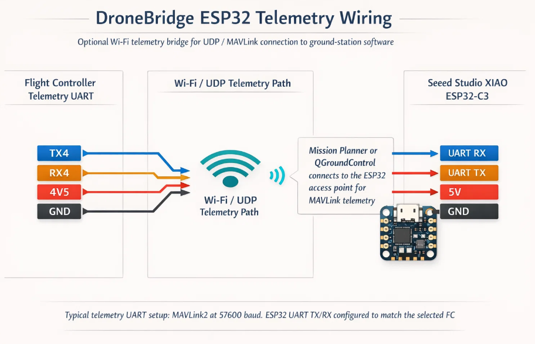

# Quadcopter UAV Build, Power System Integration, and Validation

**Author:** Hridya Satish Pisharady  
**Role:** Embedded Systems Engineer  
**Institution:** University of California, Irvine  
**Program:** Master of Embedded and Cyber-Physical Systems  
**Project Category:** UAV System Integration, Embedded Systems, and Power Validation  
**Location:** Irvine, California, USA  

---

## Overview

This repository documents the complete **end-to-end build, electrical integration, configuration, and validation** of a quadcopter UAV system.

The project focuses on **real-world embedded system engineering at the hardware–software boundary**, emphasizing:

- **Power-path design and validation**
- **Subsystem integration across electrical and communication interfaces**
- **Flight controller configuration and system tuning**
- **Structured validation workflows for reliable operation**

The result is a fully functional UAV platform validated through **bench testing, configuration verification, and controlled flight readiness checks**.

---

## Why This Project Matters

Unlike simulation-based implementations, this project required solving **real hardware challenges**, including:

- Power distribution across high-current motor systems  
- Signal integrity across UART-based subsystems  
- Debugging control-loop behavior in a multi-component system  
- Ensuring safe and stable operation through validation workflows  

This reflects the type of engineering required in **embedded systems, robotics, and electric mobility platforms**.

---

## System Architecture

The UAV system is composed of the following integrated subsystems:

- **Power System:** LiPo battery → ESCs → brushless motors + regulated power for electronics  
- **Flight Control:** ArduCopter-based controller handling stabilization and control loops  
- **Communication:** ExpressLRS receiver (UART) + telemetry link  
- **Navigation:** GPS module for positioning and system awareness  
- **Ground Interface:** Mission Planner for configuration, validation, and tuning  

All subsystems were **electrically integrated, configured, and validated as a complete system**.

---

## Key Engineering Work

- Built and integrated a quadcopter platform including **ESCs, brushless motors, battery power system, flight controller, GPS, and radio link**
- Designed and verified **power-path distribution**, ensuring stable delivery to propulsion and control subsystems
- Configured **ArduCopter firmware** and validated system behavior using Mission Planner
- Implemented and validated **UART-based communication** for receiver and telemetry systems
- Performed **system-level debugging**, including motor sequencing, control mapping, and failsafe validation
- Captured final system configuration for **repeatable deployment and troubleshooting**

---

## Validation and Testing Workflow

A structured validation pipeline was used to ensure reliability:

### Electrical Validation
- Verified **power-path integrity and wiring correctness**
- Checked voltage distribution and safe connections across subsystems

### Control Validation
- Validated **motor order and direction**
- Verified **radio channel mapping and response**
- Tested **arming/disarming logic and safety behavior**

### Communication Validation
- Confirmed **UART connectivity for receiver and telemetry**
- Verified stable communication between subsystems

### System-Level Validation
- Tested **flight modes and control stability**
- Ensured **GPS lock and navigation readiness**
- Tuned parameters for **stable and predictable flight behavior**

Final parameters were saved to enable **consistent and reproducible system bring-up**.

---

## Technologies and Tools

- **Flight Stack:** ArduCopter  
- **Ground Control:** Mission Planner  
- **Radio System:** ExpressLRS / EdgeTX  
- **ESC Firmware:** BLHeli_S  
- **Microcontroller (Telemetry):** ESP32  
- **Communication:** UART-based subsystem integration  

---
## Documentation Guides

- [Quadcopter Build Guide](docs/guides/01_quadcopter_build_guide.pdf)
- [Wiring and Interfaces Guide](docs/guides/02_wiring_and_interfaces_guide.pdf)
- [Radio and Mission Planner Setup](docs/guides/03_radio_and_mission_planner_setup.pdf)
- [Telemetry and Final Configuration](docs/guides/04_telemetry_and_final_configuration.pdf)

These guides document the full system workflow from **assembly → integration → validation → final configuration**.

---

## Certification

- [FAA TRUST Completion Certificate](https://github.com/hridyasatish/Drones/blob/main/docs/certifications/FAA_Trust_Certificate_Hridya_Satish.pdf)

Recreational UAS Safety Test (TRUST), issued in compliance with FAA requirements for drone operation.

---

## What This Project Demonstrates

- **Embedded systems integration at scale**
- **Power system design and validation**
- **Hardware–software co-design**
- **Real-world debugging and troubleshooting**
- **System-level validation and reliability engineering**
- Ability to take a system from **assembly → integration → validation → reproducible deployment**

---

## System Images

### Drone Platform





### Controller Setup





---

## System Architecture and Wiring

### Build Sequence


### System Architecture


### Receiver Wiring



### Telemetry Wiring



---

## Repository Structure

```text
Drones/
├── README.md
├── ParameterFiles/
│   └── paramsquadcopter_final.param
├── docs/
│   ├── certifications/
│   │   └── FAA_Trust_Certificate_Hridya_Satish.pdf
│   ├── diagrams/
│   │   ├── build_sequence_overview.png
│   │   ├── dronebridge_wiring.png
│   │   ├── elrs_receiver_wiring.png
│   │   └── system_architecture.png
│   ├── guides/
│   │   ├── 01_quadcopter_build_guide.pdf
│   │   ├── 02_wiring_and_interfaces_guide.pdf
│   │   ├── 03_radio_and_mission_planner_setup.pdf
│   │   └── 04_telemetry_and_final_configuration.pdf
│   └── images/
│       ├── Controller2.jpeg
│       ├── Controller3.jpeg
│       ├── Controller4.jpeg
│       ├── Drone1.jpeg
│       ├── Drone2.jpeg
│       ├── Drone3.jpeg
│       ├── Drone4.jpeg
│       ├── Drone5.jpeg
│       ├── Drone6.jpeg
│       └── Video1.mp4
